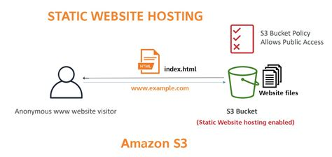

# Hosting a static webpage on AWS using S3

## Overview 

AWS S3 is an object-storage with a simple web service interface to store and retrieve any amount of data from anywhere on the web. It is an easy platform for hosting static websites and webservers. I upload a simple portfolio webpage to explore these features and to connect theoretic knowledge with practical experience.

## Tech Stack
-HTML/CSS
-Amazon S3 (Static website hosting)

## Design
A simple personal portfolio page with:
Basic layout and text
Minimal styling 
Plans to expand design functionality later

## Implementation

### Steps

1) Sign into AWS console and open Amazon S3.
   - Create a S3 bucket
   - Give a globally unique bucket name and disable "Block all public access". This allows us to view the webpage later.
   - Select the various options, such as encryption ACL as desired and click create bucket.
   - Upload your files to this bucket with "Add files". Ensure to upload all in the same root folder.
     
   

2) Enable static web hosting
   - Locate your bucket under General purpose buckets and choose "Use this bucket to host a webstie" to enable it.
   - Enter your index.html file, error document and other JSON redirection links and save changes.
     
   
   
3) At bottom of the page you can find the endpoint for your bucket.
    - You can paste this link on a browser to test, but it will say "Access denied", as we have not set a bucket policy yet

4) Add a bucket content policy
   - Under Permissions of your bucket grant read access for your website with the following policy:
   ```
    {
    "Version": "2012-10-17",		 	 	 
    "Statement": [
        {
            "Sid": "PublicReadGetObject",
            "Effect": "Allow",
            "Principal": "*",
            "Action": [
                "s3:GetObject"
            ],
            "Resource": [
                "arn:aws:s3:::Bucket-Name/*"
            ]
        }
      ]
    }
   ```
   
5)Test your endpoint 
    - The endpoint link for your bucket can now display and render your index.html file.
    
6)Clean up
    - You can re-enable "Block public access" again to stop requests charges when not using the website to minimize costs.


## Results
Successfully created a S3 bucket and hosted a public read access webpage.
Understood basic AWS S3 bucket policies and endpoint managment.
More confident to expand website and explore more aws services.

## Notes
- Billing on AWS free tier account is capped to allow exploring services for educative purposes, without incurring any additional bills for S3 storage: free 20,000 GET requests + 2000 PUT/POST/DELETE/OTHER and 5GB storage.
- You may see a high amount of requests (mine was ~93 GETs) even of a simple static server, this is due to the requirements for AWS to set the bucket enpoint and is normal.


## References
[AWS S3 Static website guide](https://docs.aws.amazon.com/AmazonS3/latest/userguide/HostingWebsiteOnS3Setup.html)
